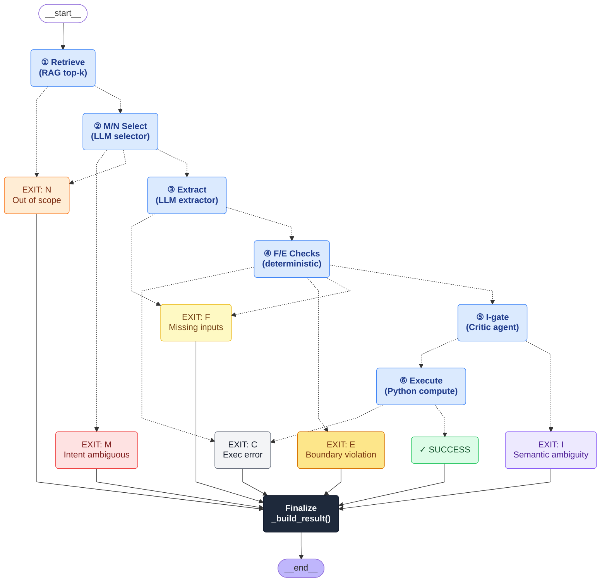

# VerifiQuant LangGraph Pipeline

```mermaid
---
config:
  flowchart:
    curve: linear
---
graph TD;
	__start__([<p>__start__</p>]):::first
	retrieve("① Retrieve\n(RAG top-k)"):::processing
	mn_select("② M/N Select\n(LLM selector)"):::processing
	extract("③ Extract\n(LLM extractor)"):::processing
	fe_checks("④ F/E Checks\n(deterministic)"):::processing
	i_gate("⑤ I-gate\n(Critic agent)"):::processing
	execute("⑥ Execute\n(Python compute)"):::processing
	exit_m("EXIT: M\nIntent ambiguous"):::exit_m
	exit_n("EXIT: N\nOut of scope"):::exit_n
	exit_f("EXIT: F\nMissing inputs"):::exit_f
	exit_e("EXIT: E\nBoundary violation"):::exit_e
	exit_i("EXIT: I\nSemantic ambiguity"):::exit_i
	exit_c("EXIT: C\nExec error"):::exit_c
	exit_success("✓ SUCCESS"):::exit_ok
	finalize("Finalize\n_build_result()"):::finalize
	__end__([<p>__end__</p>]):::last
	__start__ --> retrieve;
	execute -.-> exit_c;
	execute -.-> exit_success;
	exit_c --> finalize;
	exit_e --> finalize;
	exit_f --> finalize;
	exit_i --> finalize;
	exit_m --> finalize;
	exit_n --> finalize;
	exit_success --> finalize;
	extract -.-> exit_f;
	extract -.-> fe_checks;
	fe_checks -.-> exit_c;
	fe_checks -.-> exit_e;
	fe_checks -.-> exit_f;
	fe_checks -.-> i_gate;
	i_gate -.-> execute;
	i_gate -.-> exit_i;
	mn_select -.-> exit_m;
	mn_select -.-> exit_n;
	mn_select -.-> extract;
	retrieve -.-> exit_n;
	retrieve -.-> mn_select;
	finalize --> __end__;

    classDef processing fill:#dbeafe,stroke:#3b82f6,color:#1e3a8a,font-weight:bold
    classDef exit_m     fill:#fee2e2,stroke:#ef4444,color:#7f1d1d
    classDef exit_n     fill:#ffedd5,stroke:#f97316,color:#7c2d12
    classDef exit_f     fill:#fef9c3,stroke:#eab308,color:#713f12
    classDef exit_e     fill:#fde68a,stroke:#d97706,color:#78350f
    classDef exit_i     fill:#ede9fe,stroke:#8b5cf6,color:#4c1d95
    classDef exit_c     fill:#f3f4f6,stroke:#6b7280,color:#111827
    classDef exit_ok    fill:#dcfce7,stroke:#22c55e,color:#14532d
    classDef finalize   fill:#1e293b,stroke:#0f172a,color:#f8fafc,font-weight:bold

	classDef default fill:#f2f0ff,line-height:1.2
	classDef first fill-opacity:0
	classDef last fill:#bfb6fc
```
